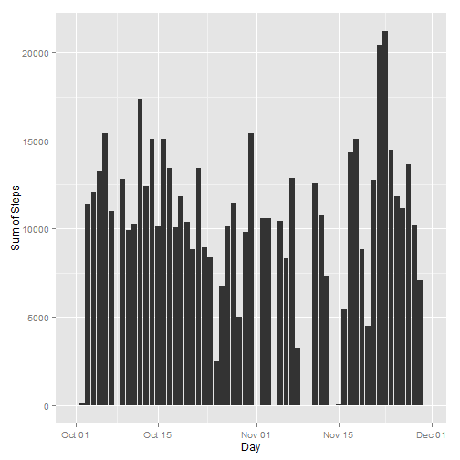
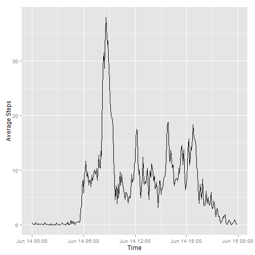
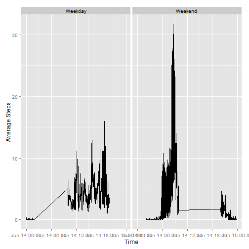

This is the first assignment for the Reproducible Research course of the Johns Hopkins University at Coursera.

The assignment is divided into multiple parts.

### 1. Loading data

Loading some packets for ease of operation. Also laoding the dataset to the memory.


```r
library(dplyr)
library(ggplot2)
data <- read.csv("activity.csv")
head(data)
```

```
##   steps       date interval
## 1    NA 2012-10-01        0
## 2    NA 2012-10-01        5
## 3    NA 2012-10-01       10
## 4    NA 2012-10-01       15
## 5    NA 2012-10-01       20
## 6    NA 2012-10-01       25
```

The above dataset is processed for ease of our analysis.

The date column is converted to Date datatype. The time variable is modified to insert a colon(:) between the hour and the minute variable.


```r
data$date <- as.Date(data$date)
data$interval <- sprintf("%03d", data$interval)
data$interval <- sub("(\\d+)(\\d{2})", "\\1:\\2", data$interval)
data <- as.tbl(data)
```

### 2. Calculating the mean total number of steps taken per day

A table for the total number of steps taken per day is shown below, immidiately followed by a histogram.


```r
data2 <- data %>% group_by(date) %>% summarise(stepsSum = sum(steps, na.rm = TRUE))
data2
```

```
## Source: local data frame [61 x 2]
## 
##          date stepsSum
## 1  2012-10-01        0
## 2  2012-10-02      126
## 3  2012-10-03    11352
## 4  2012-10-04    12116
## 5  2012-10-05    13294
## 6  2012-10-06    15420
## 7  2012-10-07    11015
## 8  2012-10-08        0
## 9  2012-10-09    12811
## 10 2012-10-10     9900
## ..        ...      ...
```

```r
qplot(data2$date, data2$stepsSum, binwidth = 0.5, geom = "histogram", stat="identity", xlab = "Day", ylab = "Sum of Steps")
```

 

The mean and the median are calculated below:


```r
mean(data2$stepsSum)
```

```
## [1] 9354.23
```

```r
median(data2$stepsSum)
```

```
## [1] 10395
```

### 3. The average daily activity pattern

A subset of the mean number of steps taken is extracted from the dataset. The interval with maximum number of steps is calculated.


```r
data3 <- data %>% group_by(interval) %>% summarise(stepsMean = sum(steps, na.rm = TRUE)/288)
data3
```

```
## Source: local data frame [288 x 2]
## 
##    interval  stepsMean
## 1      0:00 0.31597222
## 2      0:05 0.06250000
## 3      0:10 0.02430556
## 4      0:15 0.02777778
## 5      0:20 0.01388889
## 6      0:25 0.38541667
## 7      0:30 0.09722222
## 8      0:35 0.15972222
## 9      0:40 0.00000000
## 10     0:45 0.27083333
## ..      ...        ...
```

```r
filter(data3, data3$stepsMean == max(data3$stepsMean))
```

```
## Source: local data frame [1 x 2]
## 
##   interval stepsMean
## 1     8:35  37.94097
```

The interval column is converted to time datatype. Note that the time is in BST. In the end, the dataset is converted to tbl format. A meanSteps v/s interval plot is then made.


```r
# The tbl format doesnot support POSIXlt and POSIXt format, therefore the subset was converted to data.frate type
data3 <- data.frame(data3)
data3$interval <- strptime(data3$interval, format = "%H:%M",  tz="Europe/London")
qplot(data3$interval, data3$stepsMean, geom = "line", xlab = "Time", ylab = "Average Steps")
```

 

### 4. Imputing missing values

The total number of missing values in the dataset is


```r
sum(is.na(data$steps))
```

```
## [1] 2304
```

My approach to imputing the values is **replacing all the missing values to the average steps of that day.** To do this I first create a stepsMean column from the data of 61 rows. Then I repeat EACH VALUE 288 times. Note that since their are 61 repeated values the length of the vector is the same as the orignal data (61*288=17568). Now I can just replace the value in my vector with the missing valuse.


```r
data4.1 <- data %>% group_by(date) %>% summarise(stepsMean = sum(steps, na.rm = TRUE)/288)
temp1 <- rep(data4.1$stepsMean[1], 288)
for(i in 2:61)  temp1 <- append(temp1, rep(data4.1$stepsMean[i], 288))
pos <- is.na(data$steps)
data4.1 <- data
data4.1$steps[pos] <- temp1[pos]
```

Running the same old code in (2) on the new dataset. Looking at the histogram, there are no changes what so ever. *Note* that the data missing is not arbitrary but for a perticular day. **Therefore** the average for that day is zero which causes no change in the graph.


```r
data4.2 <- data4.1 %>% group_by(date) %>% summarise(stepsSum = sum(steps, na.rm = TRUE))
data4.2
```

```
## Source: local data frame [61 x 2]
## 
##          date stepsSum
## 1  2012-10-01        0
## 2  2012-10-02      126
## 3  2012-10-03    11352
## 4  2012-10-04    12116
## 5  2012-10-05    13294
## 6  2012-10-06    15420
## 7  2012-10-07    11015
## 8  2012-10-08        0
## 9  2012-10-09    12811
## 10 2012-10-10     9900
## ..        ...      ...
```

```r
qplot(data4.2$date, data4.2$stepsSum, binwidth = 0.5, geom = "histogram", stat="identity", xlab = "Day", ylab = "Sum of Steps")
```

 

Obvious from the above observation, the mean and median are unaltered.


```r
mean(data4.2$stepsSum)
```

```
## [1] 9354.23
```

```r
median(data4.2$stepsSum)
```

```
## [1] 10395
```

### 5. Activity patterns of weekdays and weekends

Identifing if whether or not a given day is a weekday.


```r
data5.1 <- data %>% mutate(Week = weekdays(date))
Week <-  (weekdays(data$date, abbreviate = TRUE) == "Sat") | (weekdays(data$date, abbreviate = TRUE) == "Sun")
data5.1$Week[Week] <- "Weekend"
data5.1$Week[!Week] <- "Weekday"
data5.1
```

```
## Source: local data frame [17,568 x 4]
## 
##    steps       date interval    Week
## 1     NA 2012-10-01     0:00 Weekday
## 2     NA 2012-10-01     0:05 Weekday
## 3     NA 2012-10-01     0:10 Weekday
## 4     NA 2012-10-01     0:15 Weekday
## 5     NA 2012-10-01     0:20 Weekday
## 6     NA 2012-10-01     0:25 Weekday
## 7     NA 2012-10-01     0:30 Weekday
## 8     NA 2012-10-01     0:35 Weekday
## 9     NA 2012-10-01     0:40 Weekday
## 10    NA 2012-10-01     0:45 Weekday
## ..   ...        ...      ...     ...
```

Now for the last part, ploting a graph for both weekday and weekend. The plot is between mean steps and interval.


```r
data5.2 <- data5.1 %>% group_by(interval, Week) %>% summarise(stepsMean = sum(steps, na.rm = TRUE)/288)
data5.2
```

```
## Source: local data frame [576 x 3]
## Groups: interval
## 
##    interval    Week  stepsMean
## 1      0:00 Weekday 0.31597222
## 2      0:00 Weekend 0.00000000
## 3      0:05 Weekday 0.06250000
## 4      0:05 Weekend 0.00000000
## 5      0:10 Weekday 0.02430556
## 6      0:10 Weekend 0.00000000
## 7      0:15 Weekday 0.02777778
## 8      0:15 Weekend 0.00000000
## 9      0:20 Weekday 0.01388889
## 10     0:20 Weekend 0.00000000
## ..      ...     ...        ...
```

```r
# The tbl format doesnot support POSIXlt and POSIXt format, therefore the subset was converted to data.frate type
data5.2 <- data.frame(data5.2)
data5.2$interval <- strptime(data5.2$interval, format = "%H:%M",  tz="Europe/London")
qplot(data5.2$interval, data5.2$stepsMean, data = data5.2, facets = ~Week, geom = "line", xlab = "Time", ylab = "Average Steps")
```

 

This concludes my analysis of the given dataset.
